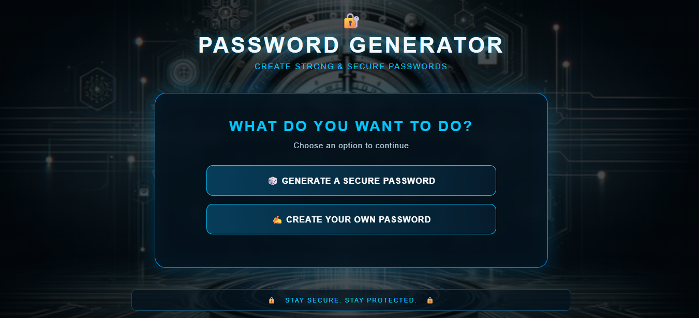

🔐 Secure Password Generator

A simple and user-friendly Password Generator web application built using Python Flask, HTML, CSS, and JavaScript.

🌐 Live Website

👉 "Open Secure Password Generator" (https://codesoft-password-generator.onrender.com)

«The live website link will be updated after deployment.»

📸 Screenshots

🏠 Home Page

🔐 Secure Password Generator

"Password Generator" (screenshots/generator.png)

✍️ Create Your Own Password

"Create Your Own Password" (screenshots/custom.png)

✨ Features

- 🔐 Generate strong and secure passwords
- ✍️ Create your own password
- 📏 Choose password length from 4 to 100 characters
- 🔠 Uppercase letters
- 🔡 Lowercase letters
- 🔢 Numbers
- 🔣 Special characters
- 💪 Password strength indicator
- 📋 Copy password to clipboard
- 🔊 Sound notification when password is copied
- 🗑 Clear password option
- 📱 Responsive design for laptop and mobile
- 🖼️ Secure-themed background design

🛠️ Technologies Used

- 🐍 Python
- 🌐 Flask
- 🧱 HTML
- 🎨 CSS
- ⚡ JavaScript

📂 Project Structure

CodeSoft Password Generator/
│
├── app.py
├── README.md
├── requirements.txt
│
├── screenshots/
│   ├── home.png
│   ├── generator.png
│   └── custom.png
│
├── templates/
│   └── index.html
│
└── static/
    ├── style.css
    ├── background.jpg
    └── copy-sound.mp3

▶️ How to Run Locally

1. Clone the repository

git clone YOUR_GITHUB_REPOSITORY_URL

2. Open the project folder

cd "CodeSoft Password Generator"

3. Install required packages

py -m pip install -r requirements.txt

4. Run the Flask application

py app.py

5. Open the local website

Open the address shown in the terminal in your browser.

🔒 Security Note

Use strong and unique passwords for important accounts. Never share your passwords with anyone.

👩‍💻 Project

This project was created as part of a Python Internship Project at CodeSoft.
